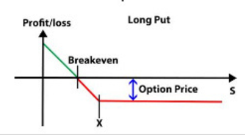
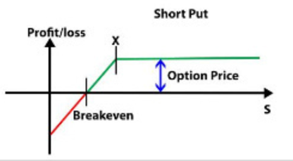
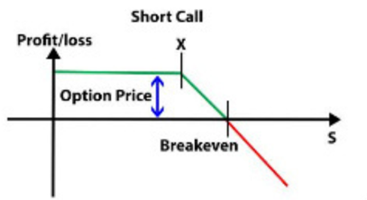
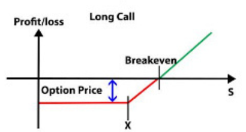

**Derivatives and Alternate Investments**

**[INTRODUCTION]{.underline}**

The history of financial derivatives dates back several centuries, with
various forms of derivative contracts being used to manage price risks
in agricultural commodities. With their early origins, the earliest
forms of derivatives can be traced to the 17th century when the forward
contracts were used in Europe for agricultural commodities. These
contracts allowed farmers and traders to set future rates and delivery
of goods. Next in the 19th century the establishment of Board Options
Exchange, in the USA paved the way for organized commodities exchange.
This created a format with a centralized marketplace and standard
contracts. Which led to standardization of trade, which happened with a
set of uniform terms and conditions like the amount of goods, period of
delivery, quantity and the value of commodities involved in trade. We
can see that financial derivatives evolved from basic forward contracts
to sophisticated instruments traded on organized exchanges and in OTC
markets. However, modern derivatives markets as we know them today have
evolved significantly over the past few decades. Derivatives continue to
be relevant and essential tools for managing risks and optimizing
investment strategies in a wide range of financial markets. Today,
financial derivatives play a significant role in global financial
markets. They offer investors opportunities for risk management,
speculation, and arbitrage. Regulation and oversight remain crucial to
ensure transparency, mitigate systemic risks, and protect investors.

Here, in various tasks we try to understand the concept of derivatives
and their relevance in financial markets. We evaluate the impact of
financial instruments or asset classes on potential enhancement of
investment value. We briefly understand the different derivatives and
look into types of Option contracts with graphs. Following a real-time
example of Mileway's acquisition by Blackstone inc. which is a private
equity firm. We explore their key objectives; investments and we display
our knowledge and our insights on their current standing based of our
knowledge and research through available information resources of the
firm.

**[CHAPTER 1: DERIVATIVES AND ASSET CLASSES]{.underline}**

The financial instruments commonly referred to as derivatives in finance
derive their value from an underlying asset or group of assets. Market
players utilize these tools to control risks, create forecasts on future
costs, and improve their investment plans. On official exchanges or
over-the-counter (OTC) marketplaces, derivatives can be exchanged.

The common derivatives are as follows:\
**Future contracts:** Futures constitute standard contracts that require
both the buyer and the seller to buy and sell an underlying asset
exactly a specified price and future date. They are employed for price
discovery, speculation, and hedging reasons. Futures on commodities,
stock indices, and currency are each commonly traded.

**Options contracts:** Options provide the holder the choice to purchase
(call option) or sell (put option) a particular asset at a certain price
within a specific period of time, but not the obligation to do so.
Options are used to speculate on market movements, gain money by premium
collection, and hedge against price volatility.

**Swaps:** Agreements for the exchange of cash flows plus other
financial variables are known as swaps. Interest rate swaps are the most
typical form, in which parties trade fixed and variable interest rate
payments. Swaps are used to manage credit, foreign exchange, and
interest rate risks.

**Forwards contracts**: Individualized agreements involving two parties
to purchase or trade on an underlying asset on a fixed price at a future
date are Forward contracts. Forward contracts are neither standardized
or exchange-traded like futures contracts are. For hedging or investing
goals, they are frequently employed in OTC marketplaces.

**Options on futures:** They're options contracts with futures contracts
as the underlying asset. Market players who are looking to hedge and
speculate on fluctuations in futures contracts sometimes make use of
mixed instruments, which use elements of options and futures.

**Credit derivatives:** Market players can transfer or hedging credit
risk through credit derivatives. (EG) credit default swaps (CDS), let
investors exchange credit risk or protect themselves against a specific
loan issuer\'s default.

**Equity derivatives**: They are employed in portfolio management,
hedging, and speculating.

**Commodity derivatives:** Trading contracts based on changes in the
prices of different commodities, like oil, gold, wheat, and natural gas,
become obtainable at commodity derivatives. For the manufacturers,
consumers, and investors of commodities, these derivatives assist
control price risks. *\[[Lennep., Oetomo, Stevenson,De Vries,
2004\]]{.mark}*

**Relevance of derivatives** is subjective to their applications and
benefits depending of the type of sector, in brief they can be explained
as:

> **Effective risk management and mitigation instruments:** They give
> market players the chance to protect themselves against an array of
> other risks, including changes in prices, exchange rates, and price
> swings. Individuals, companies, and organizations can use derivatives
> to secure their financial positions and protect themselves from future
> losses.
>
> **Market Liquidity:** By offering a venue for the trading of
> standardized contracts, derivative markets increase overall Market
> Liquidity. The ease that investors can acquire or exit positions on
> these marketplaces boosts the effectiveness of capital allocation.
> Derivative & underlying asset markets benefit from smoother
> transactions and improved price formation made possible by the
> liquidity offered by derivatives.
>
> **Capital efficiency and leverage management:** Derivatives provide
> chances for effective Capital efficiency and leverage management.
> Market players can increase their exposure to a position and a
> diversified portfolio by employing derivatives while only investing a
> small portion of the money needed to buy the underlying assets
> directly. Although it increases rewards, this leverage also entails
> greater risks.
>
> **Investing Strategies** & **Diversify their Investment Portfolios:**
> Participants in the market can adopt sophisticated Investing
> Strategies thanks to derivatives. Examples of options methods can be
> used to increase income or safeguard portfolios in market downturns
> include covered calls and protected puts. Derivatives also give
> investors access to a variety of asset classes, enabling them to
> Diversify their Investment Portfolios and perhaps boost risk-adjusted
> returns.
>
> **Speculation:** Derivatives provide ways for Speculation and make
> money based on predicted price swings. Traders and investors can use a
> variety of tactics, including long or short positions, spread trading,
> & arbitrage, to take positions on derivatives contracts and profit in
> both rising and falling markets.

The effects of derivative markets stretch deep into the economy. They
offer hedging and risk transfer methods, promoting stability in the
financial markets. Derivatives also make it possible for the money to
manage effectively and frees up investors to control risk and
concentrate on profitable endeavors. To maintain openness, stability,
and ethical business practices, regulators and policy implications keep
a careful eye on the derivatives markets*. \[[Berg,Forsythe, Nelson, F.
Rietz,2008\]]{.mark}*

**Asset Classes:**

> · **Equity derivatives**: On stocks or stock indexes, Equity
> derivatives are based. They include items like stock futures, equity
> swaps, and options on equity. Equity derivatives give investors the
> opportunity to render judgments on the course of the prices of certain
> equities or larger market indexes. They are often employed for
> portfolio management, trading strategy implementation, and risk
> hedging against equities market hazards.
>
> · **Fixed-income derivatives:** The value of Fixed-income derivatives
> is derived from debt assets like corporate and government bonds as
> well as interest rate instruments. Bond futures, swaps for interest
> rates, and options on treasury bonds are a few examples. Fixed-income
> derivatives are employed in the control of credit risks, yield curve
> tactics, and interest rate hedging.
>
> · **Currency derivative:** Foreign exchange rates are the foundation
> for Currency derivatives. They consist of items such as currency
> swaps, currency options, & currency futures. Currency derivatives
> offer a way to protect against risks associated with exchange rates
> and make wagers on changes in currency prices. They are often employed
> in international commerce and investment by multinational firms,
> banks, and investors.
>
> · **Commodity derivatives**: Physical commodities including oil, gold,
> natural gas, agricultural products, & metals provide the value for
> Commodity derivatives. Commodity futures, commodity options, &
> commodity swaps are some examples. Participants can use commodity
> derivatives to acquire exposure to the commodity markets, speculate on
> changes in commodity prices, and insure against price volatility in
> the underlying commodities.
>
> · **Credit derivatives**: Credit instruments like bonds, loans, and
> credit indexes serve as the basis for the value of Credit derivatives.
> They consist of things like total return swaps, credit spread options,
> and credit default swaps (CDS). Managing credit risks, protecting
> against defaults, and making speculation on credit quality and spreads
> are all possible by credit derivatives.

**[CHAPTER 2: HEDGING AND SPECULATION]{.underline}**

**Hedging** is a financial technique that investors should understand
and employ because of the benefits it provides. It protects an
individual\'s funds as an investment from being exposed to a dangerous
circumstance that may result in a loss of value. However, hedging does
not guarantee that the investments will not lose value. Rather, if this
happens, losses will be offset by profits in another investment.

This is how it works:

-   **[Long hedging:]{.underline}** occurs when an individual or
    corporation controls the underlying asset & wants to safeguard
    against potential price drops by taking a short-term position on a
    futures contract. If the underlying asset\'s price decreases, the
    loss in value is compensated by profits from a short futures
    position.

-   [**Short hedging**:]{.underline} On the other hand, if an individual
    nor organization expects to acquire the underlying asset in the
    future and is interested in locking onto a beneficial price, it
    might take a long position on a futures contract. If the underlying
    asset\'s price rises, the increased cost is compensated by gains
    from a long future position. *\[[Anderson, R.W. and
    Danthine\]]{.mark}*

**Speculation** in a futures exchange entails taking contracts based on
expected price changes with the underlying asset in order to profit.
Speculators aim to benefit from market movements rather than hedge their
underlying exposure.

Now let's see how it works:

-   **[Long speculation:]{.underline}** Speculators hold a long stake in
    a futures contract when they believe the underlying asset\'s price
    will climb. If their guess is true, they should sell the futures
    agreement at a higher price & profit.

<!-- -->

-   [**Short speculation:**]{.underline} Speculators short a futures
    contract since they believe the underlying asset\'s price will
    decline. If their guess is correct, they may sell the underlying
    futures contract at a reduced price and profit.

To illustrate hedging and speculation using future markets Lets consider
Monster Beverage Corporation (Monster:Listed in NASDAQ) stock at a
current price of \$59.48, and considering two scenarios with different
strike prices, as of May 30, 2023 the call option at \$32.50 and put
option at \$80.

To discuss hedging and speculation strategies using options with Monster
Beverage Corporation (Monster) stock, with a stock price of \$59.48, and
considering call and put options with different strike prices, let\'s
explore how these strategies can be applied:

**Hedging with Options:**

> If an investor holds a long position in Monster stock and wants to
> protect against potential downside risk, the investor can purchase put
> options with a strike price of \$80(as of May 30, 2023). This put
> option gives the investor the right to sell Monster shares at \$80,
> protecting against a potential decline in the stock price. If the
> price of Monster stock decreases below the strike price of \$80, the
> put option provides downside protection. The investor can exercise the
> put option, selling the shares at the higher strike price and
> mitigating losses in the stock position.

**Speculation with Options:**

> If a trader believes that Monster stock will experience significant
> price appreciation. The trader can purchase call options with a strike
> price of \$32(as of May 30, 2023). This call option gives the trader
> the right to buy Monster shares at \$32, potentially benefiting from
> the anticipated price increase. If the price of Monster stock rises
> above the strike price of \$32, the call option allows the trader to
> profit from the price appreciation. The trader can exercise the call
> option, buying the shares at the lower strike price and realizing
> gains. *\[[Chernenko, S. and Faulkender\]]{.mark}*

**[CHAPTER 3: CALL AND PUT OPTIONS]{.underline}**

**[Call option:\
\
]{.underline}** A call option, sometimes known as a \"call,\" is a type
of derivatives contract that grants the buyer the authority, but not the
duty, to purchase an asset or another financial instrument for a set
price - the striking price of the option - within a given time frame. If
the buyer agrees to use their option to purchase, the seller with the
option has a duty to sell the collateral to them. The option buyer may
utilize the option in any time before the expiration date. The
expiration date might be three, six, or even a year in the future.

**[Put option:]{.underline}**

A put option grants you the right, but not the responsibility, to sell a
stock at a specified price at a specific time - at the expiration of the
option. The put bidder pays the seller an amount of money known as a
premium for this privilege. In contrast to stocks, which may exist
continuously, an option expires and is resolved, either with some value
left or having the option expiring absolutely worthless. *\[[Grabbe,
J.O., 1983\]]{.mark}*

**[Long put:]{.underline}**

A long put option is bought in expectation of a drop in the underlying
asset. The term \"long\" in this context will not relate to the amount
of time before expiry, but rather to the trader\'s conduct of purchasing
the option in the expectation of selling it at a greater price at a
later date.{width="2.9969849081364828in"
height="1.6583814523184601in"}

**[Short put:]{.underline}**

A short put option is simply the exchange on a put option. You are
termed to short a put option when you sell it. When shorting a put
option, a trader sells the right to trade short the option\'s underlying
stock at a later point - any time before the option\'s expiry - at the
strike price along with the number of shares stated in the contract.

{width="2.572471566054243in"
height="1.421875546806649in"}

**[Short call:]{.underline}**

A short call is an option position used as a trading technique when the
trader believes the price of the underlying asset will fall. As a
result, it is regarded as a negative trading strategy.

{width="2.744792213473316in"
height="1.4971587926509187in"}

**[Long call:]{.underline}**

The acquisition of an options purchase option (call) is referred to as a
long call. A call option grants the option buyer the right to purchase a
specified underlying security (like stock and index) at a cost (the
strike price) till the option expires. The investor spends an option
premium, which is the price for this option, for this privilege. Once
the option is exercised, the seller for the call option gets the premium
and is obligated to provide the underlying for the exercise price.

{width="2.7872189413823274in"
height="1.5023786089238844in"}

**[CHAPTER 4: BLACKSTONE INC]{.underline}**

Blackstone Inc. is a leading global investment firm that specializes in
alternative investments. As of my knowledge cutoff in September 2021,
here are the objectives, key investments, and key achievements of
Blackstone Inc.

**Mission Statement:** Our investments are designed to preserve and grow
our limited partners\' capital, provide financial security for millions
of retirees, sovereign wealth funds, and other institutional and
individual investors, and contribute to overall economic growth.
Blackstone is one of the world\'s leading investment firms.

**Vision:** Blackstone\'s primary objective is to generate attractive
risk-adjusted returns for its investors across its various investment
strategies, including private equity, real estate, hedge funds, credit,
and infrastructure.

**Objectives:**

1\. Growth and Expansion: Blackstone aims to continue growing its assets
under management (AUM) and expanding its global presence by identifying
new investment opportunities and expanding into new markets.

2\. Investor Relations: The firm is committed to maintaining strong
relationships with its investors and providing excellent client service
to meet their needs.

3\. Corporate Responsibility: Blackstone focuses on integrating
environmental, social, and governance (ESG) considerations into its
investment processes and seeks to be a responsible steward of capital.

**[Mileway acquisition by Blackstone Inc:]{.underline}**

Mileway was acquired by Blackstone on 15^th^ Feb 2022 for a stated
transaction with a value of [€21]{.mark} billion. The transaction
entails Blackstone obtaining a majority share in Mileway, hence
increasing the investment.

The emergence of e-commerce and the increased need for last-mile
logistics facilities provided Blackstone with an appealing growth
prospect. Blackstone sought to extend its supply chain commercial
property portfolio and capitalize on the rising demand for effective
delivery services by acquiring Mileway.

Mileway\'s portfolio, which was strategically located in key European
cities, supplemented Blackstone\'s extensive real estate assets. The
acquisition enabled Blackstone to strengthen its position in important
markets, increasing its competitiveness & market share within the
logistics sector.

Long-term leases with respected tenants create consistent and recurring
income for Mileway\'s buildings. Blackstone capitalized on this source
of revenue, in line and its investment strategy of purchasing
income-generating assets having long-term value.

Mileway\'s skilled management team and comprehensive expertise in the
logistics business were key advantages to Blackstone. The purchase
allowed for knowledge-sharing & synergies among the two firms,
increasing Blackstone\'s strengths in handling the real estate sector.

The acquisition by Blackstone demonstrates the firm\'s confidence in the
practicalities of the real estate industry. This decision could boost
investor interest and cash in the sector, promoting its growth and
providing new opportunities.

Blackstone\'s acquisition of Mileway may lead to more concentration in
the logistics of the real estate market. Other big competitors might try
to unite with existing investors in order to strengthen their market
position which may result in mergers, acquisitions, and strategic
alliances.

The acquisition of Mileway by Blackstone demonstrated the financing
firm\'s commitment to capitalizing on the expanding demand for logistics
real estate, which is being driven by the fast rise of e-commerce.
Blackstone hoped to increase its market position and earn long-term
revenue from the last-mile shipping industry by using Mileway\'s
strategy portfolio and expertise. The impact of this transaction on the
sector is unknown, but it\'s got the potential to change Europe\'s
logistics real estate market.

**[REFERENCES]{.underline}**

-   [Grabbe, J.O., 1983. The pricing of call and put options on foreign
    exchange.]{.mark} *Journal of International Money and Finance*,
    *2*(3), pp.239-253.

-   [Van Lennep, D., Oetomo, T., Stevenson, M. and De Vries, A., 2004.
    Weather derivatives: An attractive additional asset class.]{.mark}
    *Journal of Alternative Investments*, *7*, pp.65-74.

-   [Newbery, D.M., 1989. Futures markets, hedging and
    speculation.]{.mark} *Finance*, pp.145-152.

-   [Chernenko, S. and Faulkender, M., 2011. The two sides of
    derivatives usage: Hedging and speculating with interest rate
    swaps.]{.mark} *Journal of Financial and Quantitative Analysis*,
    *46*(6), pp.1727-1754.

-   [Berg, J., Forsythe, R., Nelson, F. and Rietz, T., 2008. Results
    from a dozen years of election futures markets research.]{.mark}
    *Handbook of experimental economics results*, *1*, pp.742-751.

-   [Anderson, R.W. and Danthine, J.P., 1983. Hedger diversity in
    futures markets.]{.mark} *The Economic Journal*, *93*(370),
    pp.370-389.
